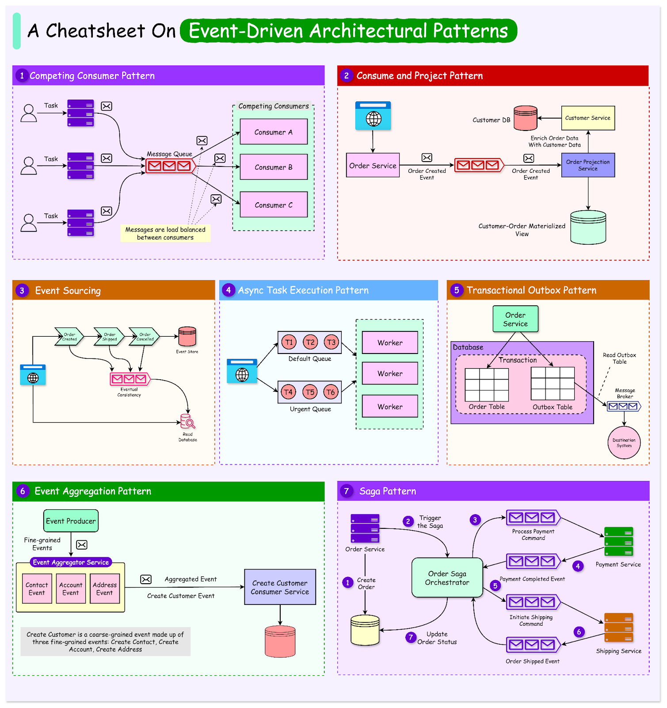

# Event-Driven Architectural Patterns  
Event-driven architecture (EDA) is a software design approach emphasizing the production, detection, consumption, and reaction to events. In this architecture, events are state changes or updates within a system. 

EDA is particularly beneficial in modern software development because it can decouple services, enhance scalability, and improve responsiveness. 

By allowing systems to react to events asynchronously, EDA supports real-time processing and enables systems to handle high volumes of data efficiently. This approach is useful in distributed systems and microservices architectures, where different components must operate independently yet cohesively.

The importance of EDA in today's software landscape cannot be overstated. It offers significant advantages such as:

    1. Improved fault tolerance because systems can continue operating even if some components fail. 

    2. Better resource utilization by enabling services to scale independently based on demand. 

    3. Supports dynamic and flexible workflows, allowing businesses to adapt quickly to changing requirements and market conditions.

In this article, we’ll explore various patterns used in event-driven architecture. By examining these patterns, the aim is to gather insights into how they can be applied to build robust, scalable, and responsive systems.  

